# 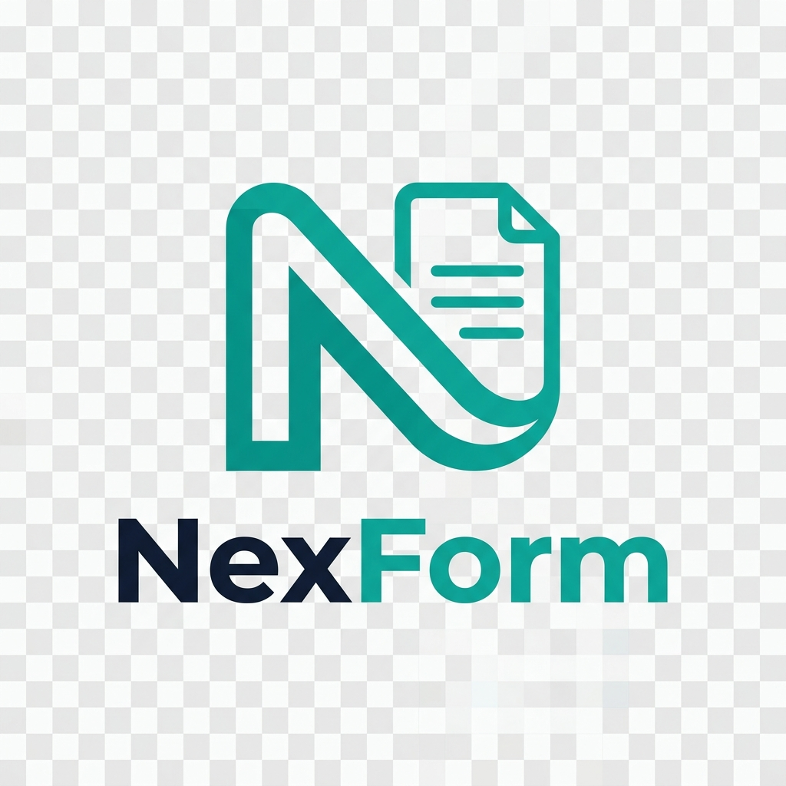 NexForm - AI-Powered Google Form Builder

## Application Preview

  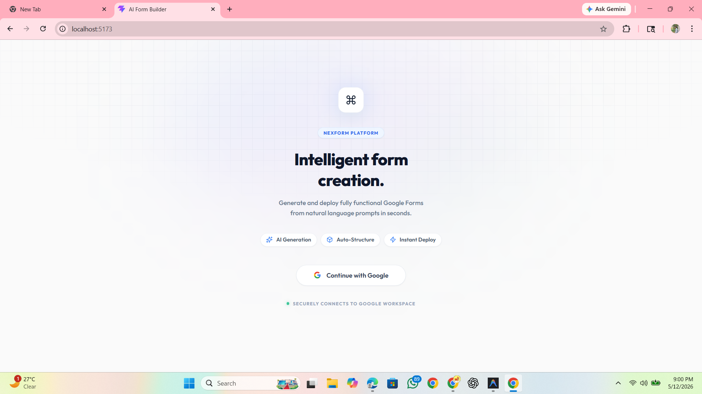

<b>🔍 Click here to view the full step-by-step workflow (Steps 2-10)</b>

 

<!-- Slide 2 -->

  
  <a href="#photo1">⬅️ Previous</a> &nbsp;&nbsp;&nbsp;&nbsp; <b>Step 2 / 10</b> &nbsp;&nbsp;&nbsp;&nbsp; <a href="#photo3">Next ➡️</a>
    
  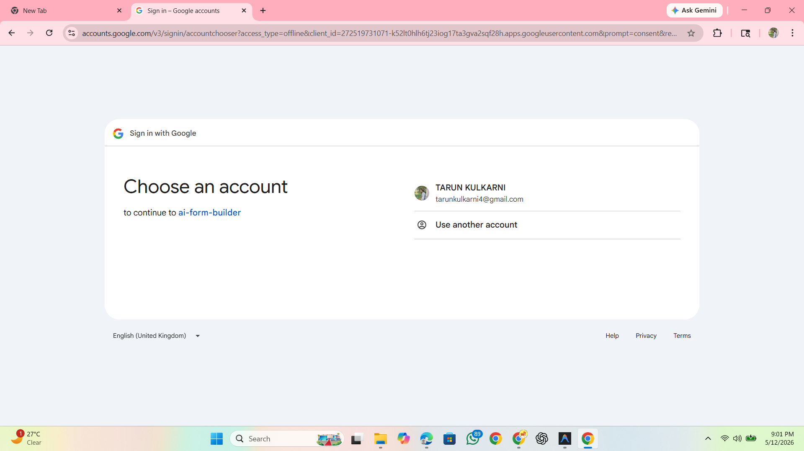

 

<!-- Slide 3 -->

  
  <a href="#photo2">⬅️ Previous</a> &nbsp;&nbsp;&nbsp;&nbsp; <b>Step 3 / 10</b> &nbsp;&nbsp;&nbsp;&nbsp; <a href="#photo4">Next ➡️</a>
    
  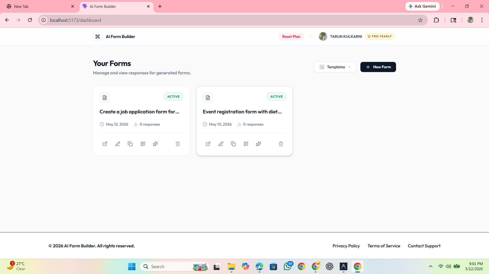

 

<!-- Slide 4 -->

  
  <a href="#photo3">⬅️ Previous</a> &nbsp;&nbsp;&nbsp;&nbsp; <b>Step 4 / 10</b> &nbsp;&nbsp;&nbsp;&nbsp; <a href="#photo5">Next ➡️</a>
    
  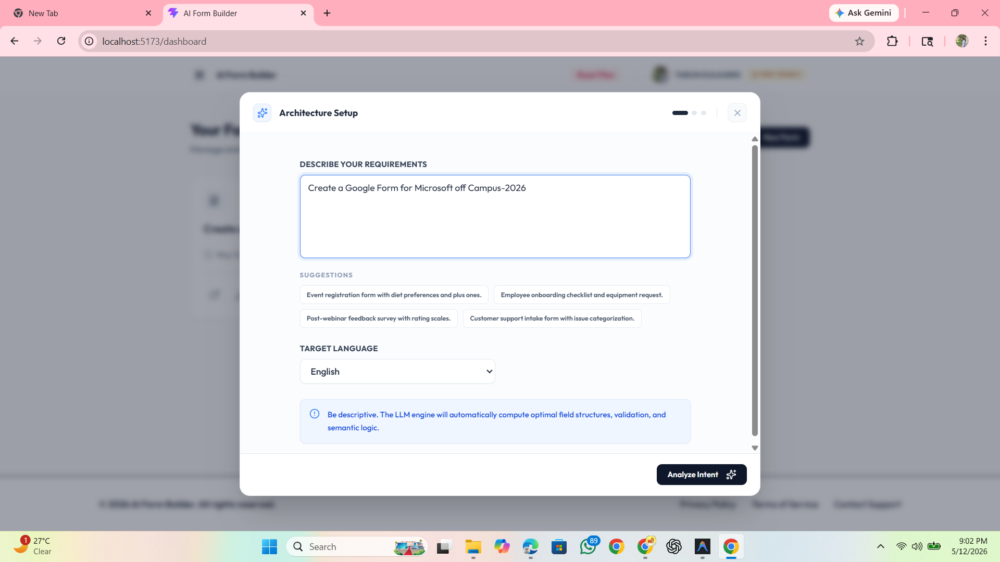

 

<!-- Slide 5 -->

  
  <a href="#photo4">⬅️ Previous</a> &nbsp;&nbsp;&nbsp;&nbsp; <b>Step 5 / 10</b> &nbsp;&nbsp;&nbsp;&nbsp; <a href="#photo6">Next ➡️</a>
    
  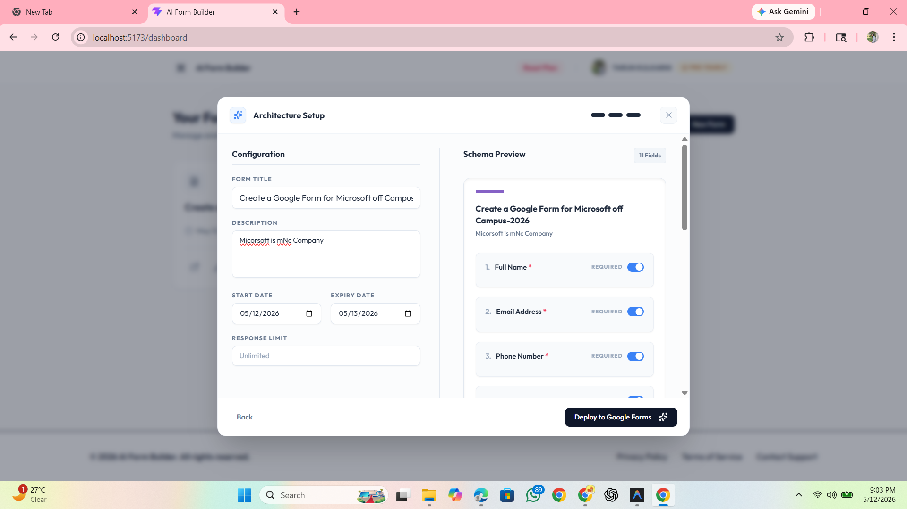

 

<!-- Slide 6 -->

  
  <a href="#photo5">⬅️ Previous</a> &nbsp;&nbsp;&nbsp;&nbsp; <b>Step 6 / 10</b> &nbsp;&nbsp;&nbsp;&nbsp; <a href="#photo7">Next ➡️</a>
    
  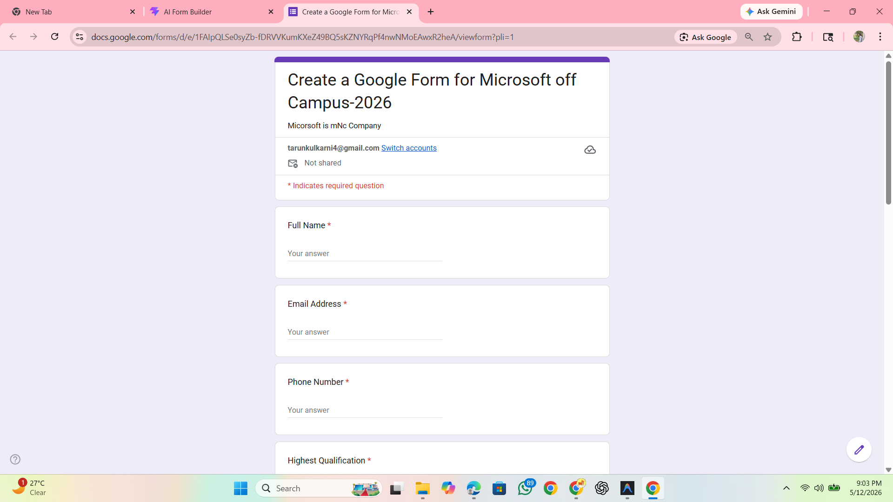

 

<!-- Slide 7 -->

  
  <a href="#photo6">⬅️ Previous</a> &nbsp;&nbsp;&nbsp;&nbsp; <b>Step 7 / 10</b> &nbsp;&nbsp;&nbsp;&nbsp; <a href="#photo8">Next ➡️</a>
    
  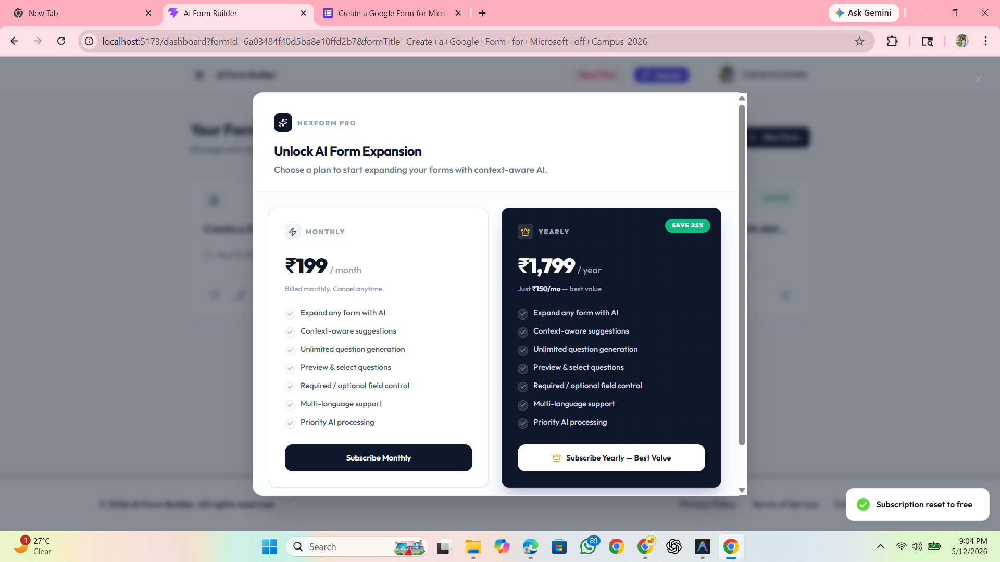

 

<!-- Slide 8 -->

  
  <a href="#photo7">⬅️ Previous</a> &nbsp;&nbsp;&nbsp;&nbsp; <b>Step 8 / 10</b> &nbsp;&nbsp;&nbsp;&nbsp; <a href="#photo9">Next ➡️</a>
    
  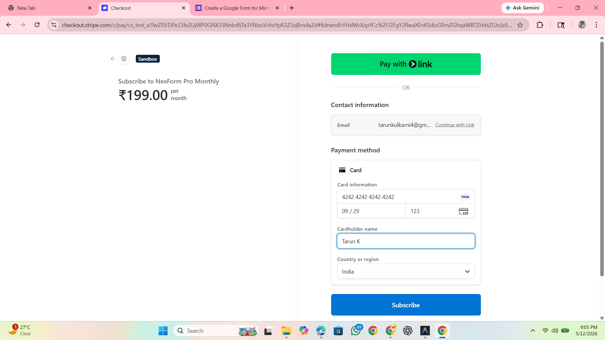

 

<!-- Slide 9 -->

  
  <a href="#photo8">⬅️ Previous</a> &nbsp;&nbsp;&nbsp;&nbsp; <b>Step 9 / 10</b> &nbsp;&nbsp;&nbsp;&nbsp; <a href="#photo10">Next ➡️</a>
    
  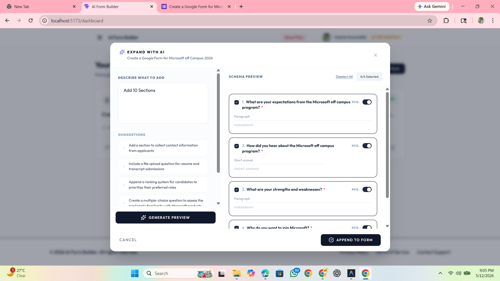

 

<!-- Slide 10 -->

  
  <a href="#photo9">⬅️ Previous</a> &nbsp;&nbsp;&nbsp;&nbsp; <b>Step 10 / 10</b> &nbsp;&nbsp;&nbsp;&nbsp; <a href="#photo1">Next ➡️</a>
    
  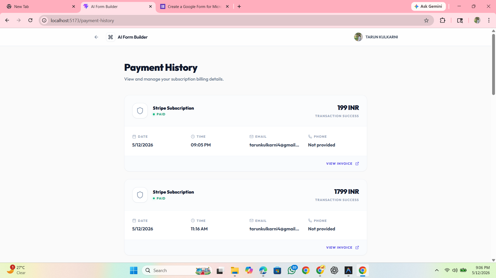

 

---

 

## **Existing System**
Traditionally, creating Google Forms is a manual process. Users must manually type each question, choose the question type (multiple choice, checkbox, etc.), and arrange them. For complex surveys or long forms, this is time-consuming and prone to human error. There's no built-in intelligence to suggest questions or structures based on the form's purpose.

## **Proposed System**
**NexForm** is a high-end, full-stack AI-powered platform that revolutionizes Google Form creation. By leveraging a **Multi-Model AI Router**, users can generate complete, professional forms from simple natural language prompts. NexForm doesn't just create forms; it intelligently suggests structures, handles complex logic, and provides an **AI Expansion** engine to grow existing forms. With direct **Google Forms API** integration and a sophisticated **Smart Link** system, NexForm provides a production-grade experience for automated data collection.

## System Architecture
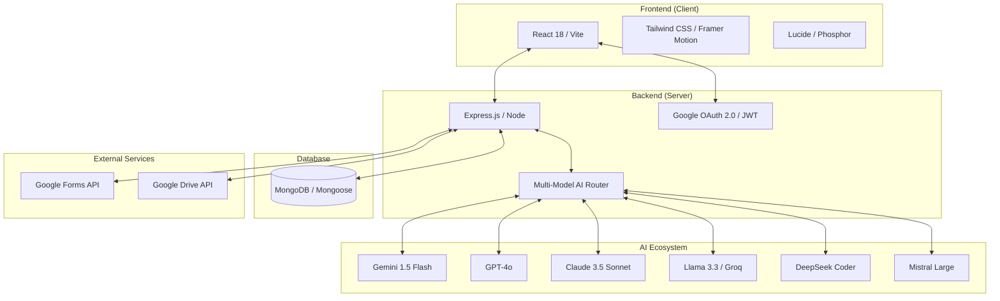

## Operational Flow
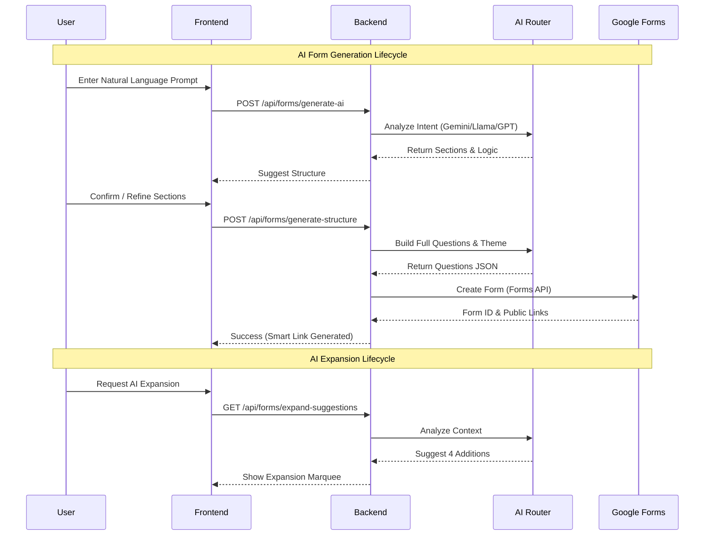

## Key Features
- 🤖 **Multi-Model Intelligence**: Harness the power of Gemini 1.5, GPT-4o, Claude 3.5, and Llama 3 via a unified router.
- 🔄 **Intelligent Fallback**: Automatic routing to backup AI models if a provider experiences downtime.
- 📈 **AI Form Expansion**: Context-aware question generation to grow and refine existing forms.
- 🔗 **Smart Link System**: Manage form access with expiry dates, response limits, and custom status toggles.
- 🎨 **Dynamic Theming**: AI-generated color palettes and layouts that match your form's intent.
- 🔐 **OAuth 2.0 Security**: Secure, scoped access to Google Drive and Forms without storing sensitive passwords.
- 📱 **Premium Aesthetics**: A responsive, glassmorphic UI with smooth Framer Motion transitions.
- 📂 **Template Engine**: Pre-designed blueprints for surveys, registrations, and feedback forms.

## Environment Configuration

To run this project, you will need to set up environment variables. Create a `.env` file in the `server` directory and add the following:

### Server & Database
- `PORT`: Port for the backend server (e.g., `5000`).
- `MONGODB_URI`: Your MongoDB connection string.
- `NODE_ENV`: Set to `development` or `production`.

### Authentication (JWT & Google OAuth)
- `JWT_SECRET`: A secure random string for token encryption.
- `GOOGLE_CLIENT_ID`: Google Cloud Console OAuth Client ID.
- `GOOGLE_CLIENT_SECRET`: Google Cloud Console OAuth Client Secret.
- `GOOGLE_CALLBACK_URL`: `http://localhost:5000/api/auth/google/callback` (for local development).

### AI Services (Multi-Model)
- `GROQ_API_KEY`: Your Groq Cloud API Key (Llama 3).
- `GEMINI_API_KEY`: Google AI Studio API Key (Gemini 1.5).
- `OPENAI_API_KEY`: OpenAI API Key (GPT-4o).
- `ANTHROPIC_API_KEY`: Anthropic API Key (Claude 3.5).
- `DEEPSEEK_API_KEY`: DeepSeek API Key.
- `MISTRAL_API_KEY`: Mistral AI API Key.

### Frontend
- `CLIENT_URL`: `http://localhost:5173` (default for Vite).

## Setup Instructions
1. Clone the repository.
2. Install dependencies in both `client` and `server` folders using `npm install`.
3. Set up environment variables based on `.env.example`.
4. Run `npm run dev` in the client and `npm start` in the server.
