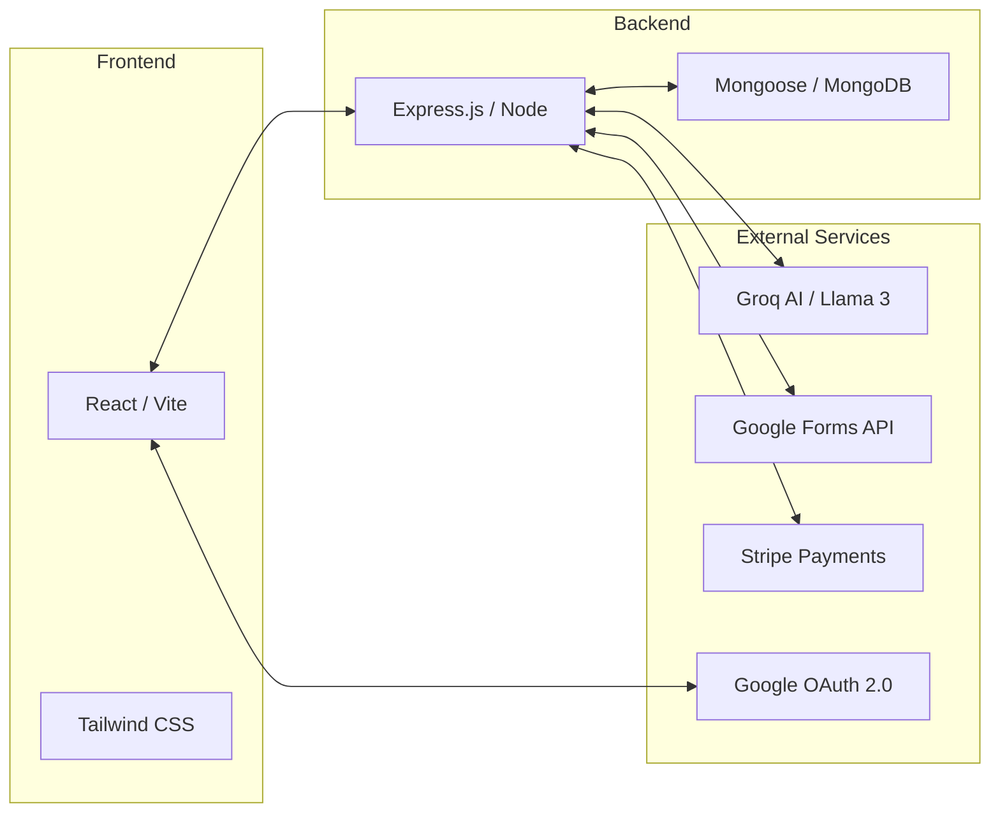
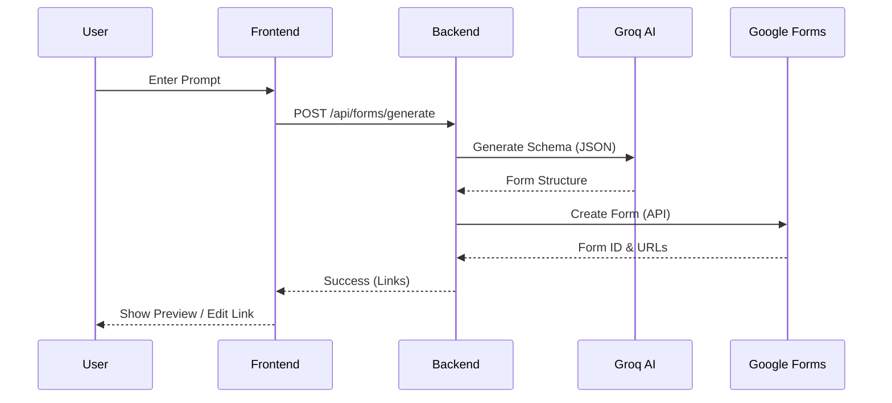

# NexForm - AI-Powered Google Form Builder

## Explanation of Existing System
Traditionally, creating Google Forms is a manual process. Users must manually type each question, choose the question type (multiple choice, checkbox, etc.), and arrange them. For complex surveys or long forms, this is time-consuming and prone to human error. There's no built-in intelligence to suggest questions or structures based on the form's purpose.

## Proposed System
**NexForm** is a full-stack AI-powered application that automates Google Form creation. By simply providing a natural language prompt (e.g., "Create a registration form for a coding bootcamp"), NexForm uses high-performance AI models (Llama 3 via Groq API) to generate a complete form structure, including titles, descriptions, and optimized question types. It then integrates directly with the Google Forms API to create the form in the user's account.

## System Architecture

## Operational Flow

## Features
- 🚀 **AI Generation**: Generate complex forms in seconds from text prompts.
- 🔐 **Secure Auth**: Google OAuth integration for direct access to Google Drive/Forms.
- 📊 **Analytics**: Track form responses and performance.
- 💎 **Premium Tier**: Subscription model for unlimited form generation.
- 📱 **Responsive Design**: Modern UI built for both desktop and mobile.

## Environment Configuration

To run this project, you will need to set up environment variables. Create a `.env` file in the `server` directory and add the following:

### Server & Database
- `PORT`: Port for the backend server (e.g., `5000`).
- `MONGODB_URI`: Your MongoDB connection string.
- `NODE_ENV`: Set to `development` or `production`.

### Authentication (JWT & Google OAuth)
- `JWT_SECRET`: A secure random string for token encryption.
- `GOOGLE_CLIENT_ID`: Google Cloud Console OAuth Client ID.
- `GOOGLE_CLIENT_SECRET`: Google Cloud Console OAuth Client Secret.
- `GOOGLE_CALLBACK_URL`: `http://localhost:5000/api/auth/google/callback` (for local development).

### AI Service (Groq)
- `GROQ_API_KEY`: Your Groq Cloud API Key for AI form generation.

### Frontend
- `CLIENT_URL`: `http://localhost:5173` (default for Vite).

## Setup Instructions
1. Clone the repository.
2. Install dependencies in both `client` and `server` folders using `npm install`.
3. Set up environment variables based on `.env.example`.
4. Run `npm run dev` in the client and `npm start` in the server.
